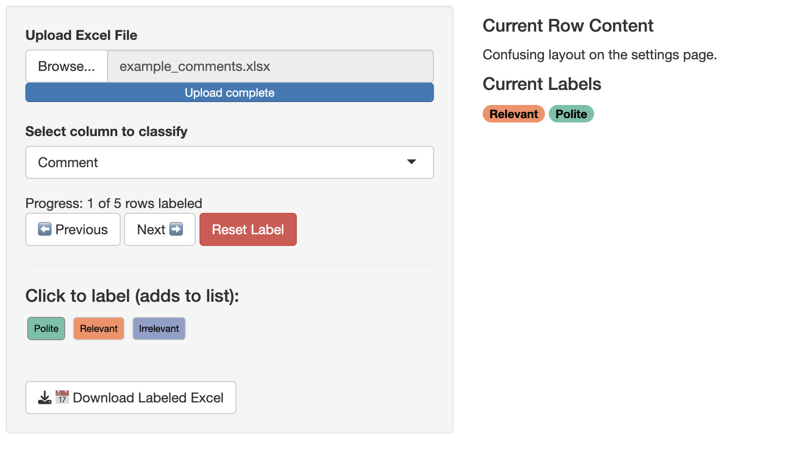

# 🗂️ Sequence qualitative coding app


[](./LICENSE)

A Shiny app for labeling rows in an Excel file using a custom set of categories. You can click multiple labels in any order, and the labels are saved as a semicolon-separated list in a new column.



## Features
- Upload `.xlsx` file and choose a column to annotate
- Apply multiple labels per cell
- Reset label for any row
- Preview each row with **Markdown rendering**
- Export the labeled Excel file anytime

## Getting Started

1. Install R and R packages:
```r
install.packages(c("shiny", "readxl", "writexl", "RColorBrewer", "markdown"))
```
2. Configure your labels in `label_list`.
3. Run the app:
```r
shiny::runApp()
```
